<!-- # Overview -->
This project compares a several types of integrators that fall under the implicit and explicit types as well as the associated math needed to get them running.

<!--more-->

# State
The term state is heavily loaded word, but in the world of controls it represents a single variable or a collection of variables that fully determine a single snapshot of the problem being considered. The choice of state is completely up to the person setting up the problem and there exists several different parameterizations for popular controls problems that result in different state representations which can be transformed from one representation to another since all of them determine the problem at that moment completely.

For the toy problem considered here, the double pendulum, we can choose the following parameterization.

  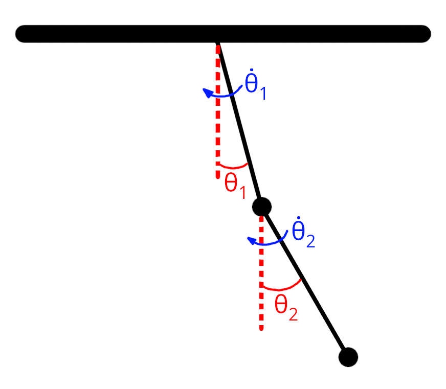
   
  <em>Chosen state variables representing the state of the double pendulum.</em>

The vector representing the state is then:

$$
\begin{bmatrix}
\theta_1 \\
\dot{\theta_1} \\
\theta_2 \\
\dot{\theta_2}
\end{bmatrix}
$$

# Dynamics
In the domain of optimal control, there are a few "functions" or "quantities" that we run into very often with and one that crops up very often is the dynamics function. The dynamics function in this context is a function that returns the rate of change of the state variables with respect to time. For our problem under consideration here, the double pendulum problem, the dynamics equations are described below.

For a state given by 

$$
x = \begin{bmatrix} \theta_1 & \dot{\theta_1} & \theta_2 & \dot{\theta_2} \end{bmatrix}
$$

the derivatives of the variables with respect to time can be written as

$$
\begin{aligned}
\dot{\theta}_1 &= \dot{\theta_1},\\
\dot{\theta}_2 &= \dot{\theta_2},\\
\dot{\omega}_1 &= \frac{m_2 l_1 \omega_1^2\sin(\Delta)\cos(\Delta) + m_2 g\sin(\theta_2)\cos(\Delta) + m_2 l_2 \omega_2^2\sin(\Delta) - (m_1+m_2) g\sin(\theta_1)}{\mathrm{\alpha}_1},\\
\dot{\omega}_2 &= \frac{-m_2 l_2 \omega_2^2\sin(\Delta)\cos(\Delta) + (m_1+m_2) g\sin(\theta_1)\cos(\Delta) - (m_1+m_2) l_1 \omega_1^2\sin(\Delta) - (m_1+m_2) g\sin(\theta_2)}{\mathrm{\alpha}_2}.
\end{aligned}
$$

Where,
$$
\qquad \Delta \theta = \theta_2 - \theta_1.
$$

and,

$$
\mathrm{\alpha}_1 = (m_1+m_2)\,l_1 - m_2\,l_1\cos^2(\Delta),
\qquad
\mathrm{\alpha}_2 = \frac{l_2}{l_1}\,\mathrm{\alpha}_1.
$$

# Why Integrate
When trying to model a system, we often end up with an ODE like the following

$$
\dot{x} = f(x, u)
$$

that we would like to solve for the function $x(t)$ given boundary conditions like the initial state $x(0) = x_0$ and the control input $u(t)$ for all $t$.

The function $x(t)$ is simply the resulting trajectory of the system over time.

These types of ODEs can be linear or non-linear. Linear ODEs have tried and tested general solution methods that can be applied. The non-linear ODEs on the other hand are often very hard to solve and don't have general methods that can be applied.

Most models that approximate real world systems are usually highly non-linear for any real interesting problem.

In such cases we often resort to solving the discretized version of the problem that is written out as

$$
x_{k+1} = f(x_{k}, u_{k})
$$

This form of the dynamics can now be solved using some of the techniques described in the sections hereafter.

One caveat to keep in mind is that the act of discretization introduces possibly unwanted effects into the model. When discretizing and selecting numerical solution methods, it is important to understand the nuances associated with each method and use the one that best serves the problem at hand.

# Explicit Integrators

Now that have the discrete form of the dynamics as in

$$
x_{k+1} = f(x_{k}, u_{k})
$$

we can take a look at methods of integrating this system.

## Forward Euler Integration
This is the absolute simplest integration scheme that can be used for this problem. The integration is computed as

$$
x_{k+1} = x_{k} + \Delta t \times f(x_{k}, u_{k})
$$

$\Delta t$ here is a small timestep over which we simply assume that the dynamics are constant and equal to $f(x_{k}, u_{k})$.

All we are doing here is using a linear approximation at the current state, and then extrapolating that forward over the time step $\Delta t$ to get the next state. This is depicted pictorially below.

  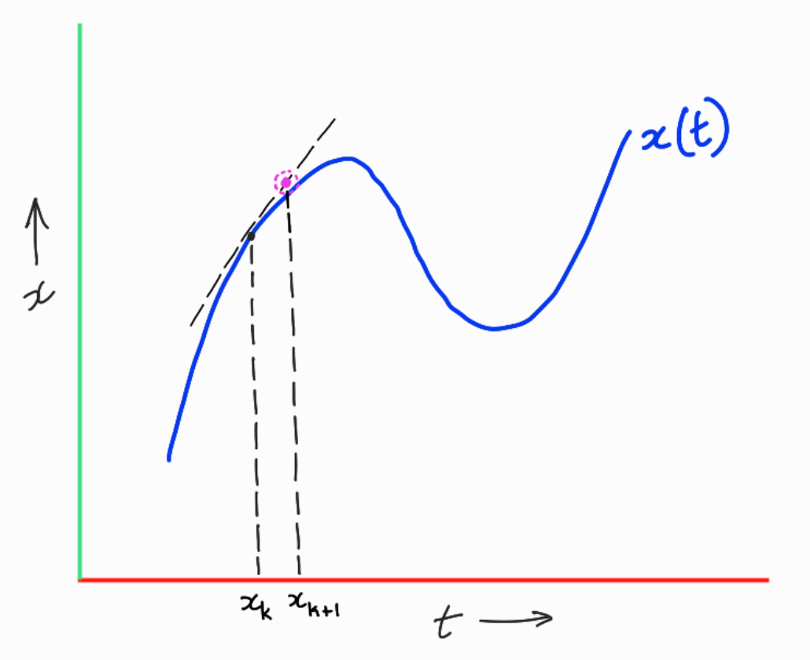
   
  <em>Forward Euler Method Visualization.</em>

An animation of the integrated trajectory using the forward Euler method for a double pendulum with unit masses and lengths and g = 9.8, dt = 0.01 seconds and initial state of $x_0 = [\pi/1.6, 0, \pi/1.8, 0]$ is shown below.

<video
  controls
  autoplay
  loop
  muted
  playsinline
  style="display:block; margin: 0 auto; max-width:100%; height:auto;"
  width="1000"
>
  <source src="/assets/projects/integrators/forward_euler_animation.mp4" type="video/mp4">
  Your browser does not support the video tag.
  <a href="/assets/projects/integrators/forward_euler_animation.mp4">Download the video</a>.
</video>

What the forward Euler method provides in terms of simplicity and ease of implementation, it lacks in terms of accuracy, stability and realism. One of the biggest drawbacks of the forward Euler method is that it does not preserve the energy of the system. This can lead to unrealistic trajectories that diverge from the true solution over time.

The total energy of the double pendulum system is plotted below for the forward Euler integration method applied to the same initial conditions as above.

  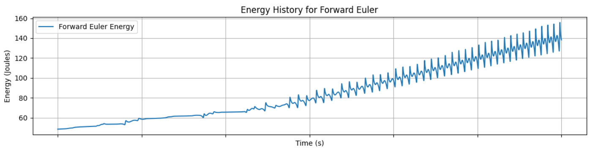
   
  <em>Energy vs Time for Forward Euler Integration of the double pendulum problem.</em>

This trendline shows how the energy of the system increases over time and nearly triples at the end of 30 seconds (Starting at ~48 Joules and ending at ~140 Joules).

The forward Euler method is best used for understanding the basics of numerical integration and is rarely ever used in practice for problems of any consequence.

**Note**: The energy conservation plots and state variable evolution plots for the other integrators are shown in the [Comparison of Integrators](#comparison-of-integrators) section at the end of this page and won't be discussed in the sections describing the other integrators.

## Midpoint Method of Integration
The mid-point method is a slight modification of the forward Euler method that provides significant performance improvements over the forward Euler method. The mid-point method as it's name would indicate is computed as follows.

$$
x_{mid} = x_{k} + \frac{\Delta t}{2} \times f(x_{k}, u_{k})
$$

$$
x_{k+1} = x_{k} + \Delta t \times f(x_{mid}, u_{k})
$$

What's happening here is that we first compute an intermediate state using the forward Euler method itself but with a half time step. This gives us an approximation of a state in between $x_k$ and $x_{k+1}$. With that midpoint state that we call $x_{mid}$, we then compute the dynamics at $x_{mid}$ and use that to compute the next state using the dynamics for the whole time step $\Delta t$ and incrementing from $x_k$.

This is depicted pictorially below.

  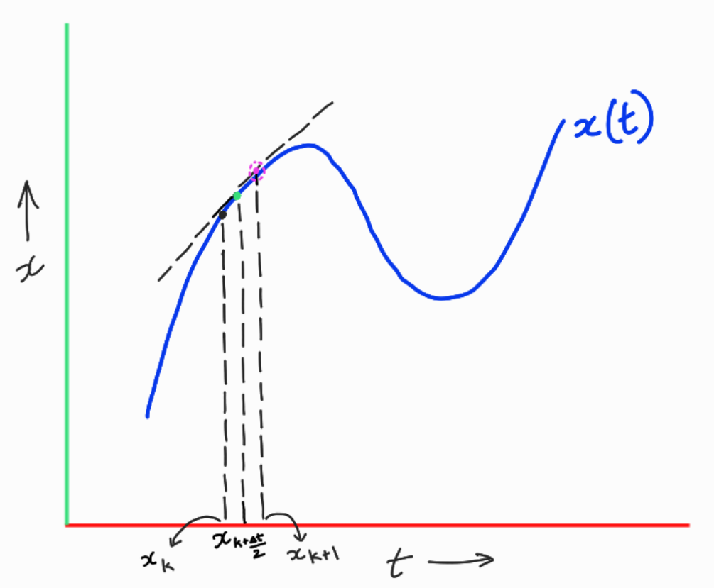
   
  <em>Midpoint Method Visualization.</em>

In this visualization, the mid-point is colored green at which the dynamics is evaluated and then used to compute the next state shown in purple.

An animation of the integrated trajectory using the midpoint method for a double pendulum with unit masses and lengths and g = 9.8, dt = 0.01 seconds and initial state of $x_0 = [\pi/1.6, 0, \pi/1.8, 0]$ is shown below.

<!-- 

  
   
  <em>Forward Euler Integration of the double pendulum problem.</em>

 -->

<video
  controls
  autoplay
  loop
  muted
  playsinline
  style="display:block; margin: 0 auto; max-width:100%; height:auto;"
  width="1000"
>
  <source src="/assets/projects/integrators/midpoint_animation.mp4" type="video/mp4">
  Your browser does not support the video tag.
  <a href="/assets/projects/integrators/midpoint_animation.mp4">Download the video</a>.
</video>

## Fourth Order Runge-Kutta Method of Integration

The fourth order Runge-Kutta method is a more sophisticated method of integration that provides even better performance than the midpoint method. The RK4 method is computed as follows.

$$
\begin{aligned}
k_1 &= f(x_k, u_k) \\
k_2 &= f\left(x_k + \frac{\Delta t}{2} k_1, u_k\right) \\
k_3 &= f\left(x_k + \frac{\Delta t}{2} k_2, u_k\right) \\
k_4 &= f\left(x_k + \Delta t k_3, u_k\right) \\
x_{k+1} &= x_k + \frac{\Delta t}{6} (k_1 + 2k_2 + 2k_3 + k_4)
\end{aligned}
$$

I have no visualization for this method cause it combines too many derivatives and I have no idea what exactly should be visualized :D, but, the important idea is that this method combines the derivatives at multiple points along the timesteps and then weights them to get the final estimate of the derivative term which is used to compute the next state.

However, here is the animation for the RK4 method for the same double pendulum problem with the same initial conditions as above.

<video
  controls
  autoplay
  loop
  muted
  playsinline
  style="display:block; margin: 0 auto; max-width:100%; height:auto;"
  width="1000"
>
  <source src="/assets/projects/integrators/rk4_animation.mp4" type="video/mp4">
  Your browser does not support the video tag.
  <a href="/assets/projects/integrators/rk4_animation.mp4">Download the video</a>.
</video>

**Note:** The animations for the different integrators are all generated using the same initial conditions and parameters. The only difference is the integration method used to compute the trajectory. I have only included animations for the explicit methods since the outputs  from the implcit methods look similarly chaotic and hard to visually distinguish from the explicit methods (excluding the forward Euler method due to its rapidly increasing energy).

# Implicit Integrators

Implicit representations of the discretized dynamics are simply the discretized dynamics equations expressed in such a way that the dependent variable is part of the expression to be evaluated. Implicit methods require specialized solvers. In our case, we do this by solving it as a root finding problem. First, we will take a look at the simplest implicit method and then look at how to solve it using a root finding method called Newton's method.

## Backward Euler Method

The backward Euler method is the implicit version of the forward Euler method where we make two changes. First, instead of evaluating the dynamics at the current state $x_k$, we evaluate it at the next state $x_{k+1}$. Second, we rearrange the equation to the following form.

$$
g(x_{k+1}) = x_{k} + \Delta t \times f(x_{k+1}, u_{k}) - x_{k+1}
$$

And we call this new function $g(x_{k+1})$.

We know that for the correct next state $x_{k+1}$, the first two terms will sum to $x_{k+1}$ and thus the function $g(x_{k+1})$ will evaluate to zero. Thus, our goal here is to find that value of $x_{k+1}$ that makes $g(x_{k+1})$ equal to zero.  This is what a root finding problem is. For a function $g(x)$, we want to find the value of $x$ that makes $g(x) = 0$.

## Root Finding with Newton's Method

In a typical root-finding context, we are given some function $g(x)$ and we want to find the value of $x$ that makes $g(x) = 0$.

Let's say that this function looks as shown in the figure below.

  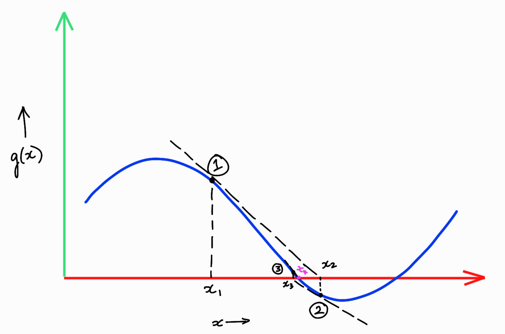
   
  <em>Visualization of newtons method applied to a root finding problem.</em>

The Newton's method when applied to this example function $g(x)$ would run something like this.

1. First, we start with an initial guess of what this root might be. Let's call this initial guess $x_1$. This is shown in the figure above.

2. What we want to do from $x_1$ is find a better guess for what the root might be. In order to do this, we first obtain the taylor series linearization of the function $g(x)$ around the point $x_1$. This is also shown in the figure above as the black dotted tanget line at point $x_1$.

3. The first order taylor series expansion of the function $g(x)$ around the point $x_1$ is given by

$$
g(x) \approx g(x_1) + g'(x_1)(x - x_1)
$$

4. We attempt to get the next best guess by setting this first order approximation to zero, i.e. in this simple case that equates to trying to find for what value of $x$ does the tangent line intersect the x-axis. We rearrange the taylor series expansion to get the next guess as follows.

$$
\begin{aligned}
0 &= g(x_1) + g'(x_1)(x - x_1) \\
x &= x_1 - g'(x_1)^{-1} g(x_1)
\end{aligned}
$$

$\hspace{2em}$ For a real valued function with vector inputs, the term $g'(x_1)^{-1}$ is the inverse of the jacobian of $g$ evaluated at $x_1$.

5. The important term here is $g'(x_1)^{-1} g(x_1)$ which is the correction term that we apply to our initial guess $x_1$ to get the next guess $x_2$.

6. This process is then repeated. The next corrective term is computed as $g'(x_2)^{-1} g(x_2)$ and applied to $x_2$ to get $x_3$ and so on until we converge to the root which in the figure above is marked as $x_4$ drawn in purple.

7. Typically this iterative process is repeated until a stopping criteria is met which is usually when the value of $g(x_i)$ is less than some small threshold $\epsilon$ specified by the user. Here, $x_i$ is the ith guess in the sequence of guesses generated by the method.

Applying this to the backward Euler method and setting up the problem as above for the explicit methods, we can get the following animation.

<video
  controls
  autoplay
  loop
  muted
  playsinline
  style="display:block; margin: 0 auto; max-width:100%; height:auto;"
  width="1000"
>
  <source src="/assets/projects/integrators/backward_euler_animation.mp4" type="video/mp4">
  Your browser does not support the video tag.
  <a href="/assets/projects/integrators/backward_euler_animation.mp4">Download the video</a>.
</video>

The damping effect of the backward Euler method is very clear in this animation. The trajectory quickly converges down to the equilibrium point of $\theta_1 = 0$ and $\theta_2 = 0$.

So with the solution method in place, we can look at the remaining two implicit integrators.

## Implicit Midpoint Method

The expression for the implicit midpoint method is given by

$$
g(x_{k+1}) = x_{k} + \Delta t \times f\left(\frac{x_k + x_{k+1}}{2}, u_k\right) - x_{k+1}
$$

## Hermite Simpson Method

The expression for the Hermite Simpson method is given by

$$
\begin{aligned}
x_{intermediate} &= \frac{x_k + x_{k+1}}{2} + \frac{\Delta t}{8} \left(f(x_k, u_k) - f(x_{k+1}, u_k)\right) \\
g(x_{k+1}) &= x_k + \frac{\Delta t}{6} \left(f(x_k, u_k) + 4f(x_{intermediate}, u_k) + f(x_{k+1}, u_k)\right) - x_{k+1}
\end{aligned}
$$

# Comparison of Integrators

One common basis for comparing integrators is by looking at the total energy of the system over time. For an idealized closed physical system, the total energy over time should be conserved as long as no external energy has been added. Since the double pendulum system described here is a closed system, we can compare the energy over time for the different integrators.

The initial state used here is $x_0 = [\pi/1.6, 0, \pi/1.8, 0]$ and the parameters are unit masses and lengths and g = 9.8. The time step used for all the integrators is $\Delta t = 0.01$ seconds and the total time of integration is 30 seconds.

  
   
  <em>Visualization of energy over time for the Forward Euler Method.</em>

Looking at the energy trend for the forward Euler method, it is clear that there is a very noticeable artificial increase in energy over time. In fact, at the end of 30 seconds, the energy has nearly tripled from its initial value of around 48 Joules to around 140 Joules. This is a clear indication that the forward Euler method does not preserve the energy of the system and thus can lead to unrealistic trajectories over time.

  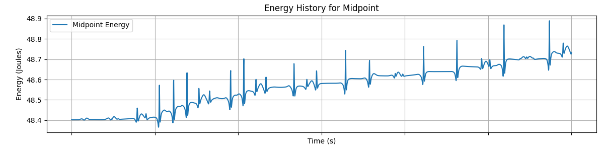
   
  <em>Visualization of energy over time for the Midpoint Method.</em>

  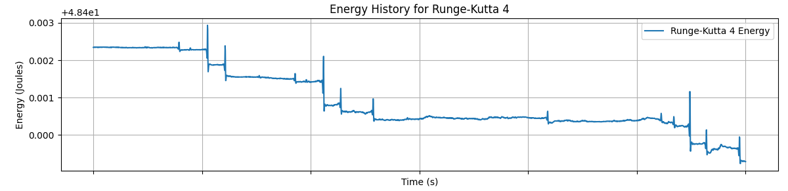
   
  <em>Visualization of energy over time for the Fourth-Order Runge-Kutta Method.</em>

The midpoint method and the fourth order Runge-Kutta method both show significant improvements over the forward Euler method in terms of energy preservation. In the midpoint method, the energy varies around 48.4 Joules in the tenths place. In RK4, the energy only varies in the thousandths place.

  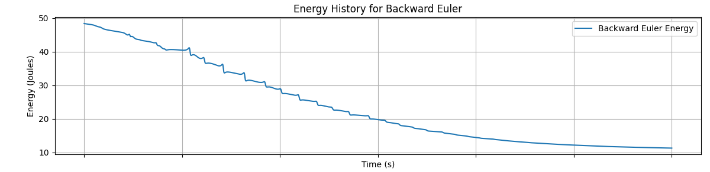
   
  <em>Visualization of energy over time for the Backward Euler Method.</em>

The backward Euler method on the other hand also performs poorly in terms of energy preservation but in the opposite way compared to forward Euler. In this case, the integrated trajectory becomes artifically damped. This is attributed to the fact that the backward Euler uses a derivative computed at a future state at the previous step which undercuts the true evolution of the trajectory over time.

  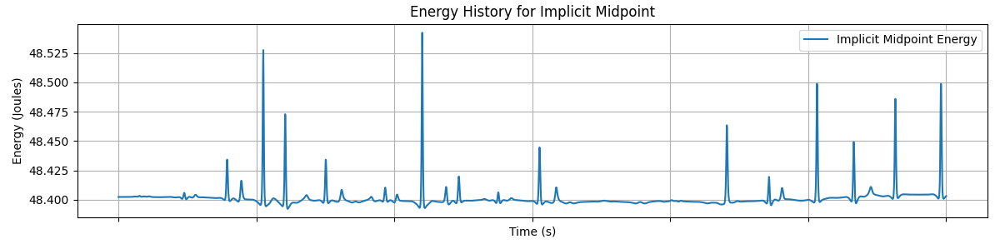
   
  <em>Visualization of energy over time for the Implicit Midpoint Method.</em>

  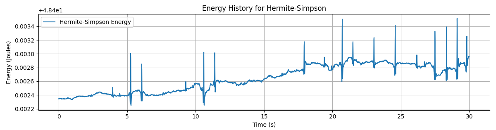
   
  <em>Visualization of energy over time for the Hermite Simpson Method.</em>

The implicit midpoint method and the Hermite Simpson method are both similar to their explicit counterparts in that they both are pretty stable around the initial energy. The implicit midpoint varies in the tenths place while the Hermite Simpson method varies in the thousandths place.

# Trajectory Evolution over Time for the different Integrators

The following plots show the evolution of the state variables $\theta_1$ and $\theta_2$ over time for the different integrators. 

In the forward euler trajectory, we can see that the $\theta_2$ starts going haywire spinning faster and faster as energy in the system goes on increasing.

In the backward Euler trajectory, the state variables are seen to gradually settle down at the equilibrium point of $\theta_1 = 0$ and $\theta_2 = 0$.

The other plots show the evolution over time of the state variables. Since the double pendulum is very chaotic, small numerical differences accentuate over time and the trajectories begin to look very different from each other eventually.

  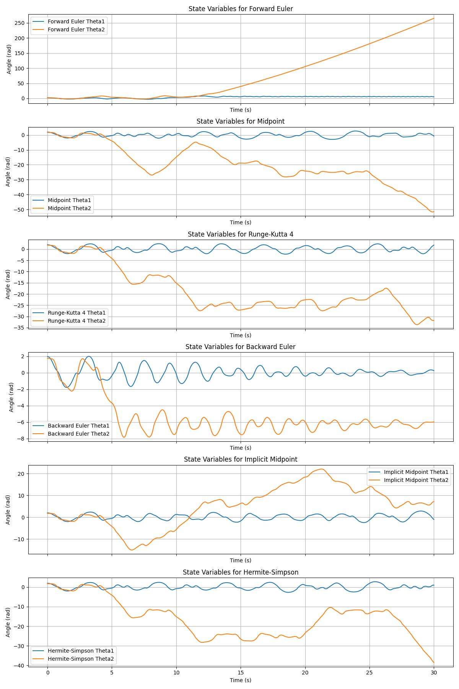
   
  <em>Visualization of state variables over time for the Hermite Simpson Method.</em>

# Computation Time Comparison

The implementation available on github includes both jax optimized versions of the simulation and integration methods as well as non-jax versions.

<table>
  <thead>
    <tr>
      <th colspan="2" style="text-align:center; font-weight:700; font-size:150%;">Simulation Time (Jax)</th>
    </tr>
    <tr>
      <th>Integrator</th>
      <th align="right">Computation time (s)</th>
    </tr>
  </thead>
  <tbody>
    <tr><td>Forward Euler</td><td align="right">0.27</td></tr>
    <tr><td>Midpoint</td><td align="right">0.28</td></tr>
    <tr><td>RK4</td><td align="right">0.45</td></tr>
    <tr><td>Backward Euler</td><td align="right">1.43</td></tr>
    <tr><td>Implicit Midpoint</td><td align="right">1.41</td></tr>
    <tr><td>Hermite Simpson</td><td align="right">2.29</td></tr>
  </tbody>
</table>

<table>
  <thead>
    <tr>
      <th colspan="2" style="text-align:center; font-weight:700; font-size:150%;">Simulation Time (Non-Jax)</th>
    </tr>
    <tr>
      <th>Integrator</th>
      <th align="right">Computation time (s)</th>
    </tr>
  </thead>
  <tbody>
    <tr><td>Forward Euler</td><td align="right">9.26</td></tr>
    <tr><td>Midpoint</td><td align="right">11.97</td></tr>
    <tr><td>RK4</td><td align="right">18.97</td></tr>
    <tr><td>Backward Euler</td><td align="right">104.64</td></tr>
    <tr><td>Implicit Midpoint</td><td align="right">111.76</td></tr>
    <tr><td>Hermite Simpson</td><td align="right">363.27</td></tr>
  </tbody>
</table>

# Code
[View on GitHub](https://github.com/stevenbrills/optimal_control_projects)